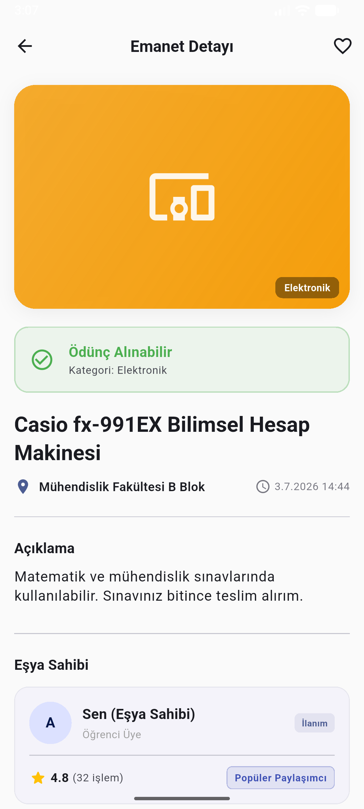
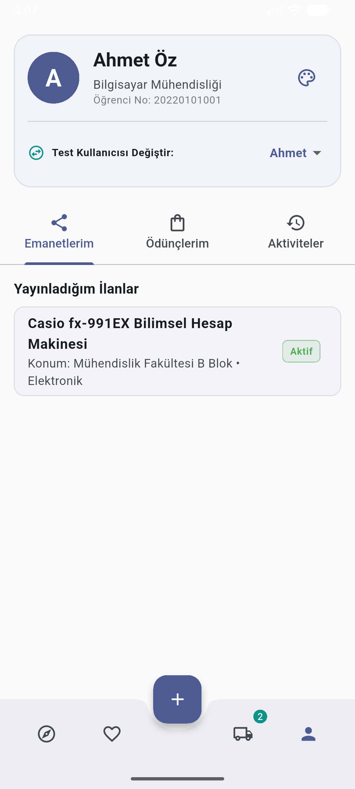
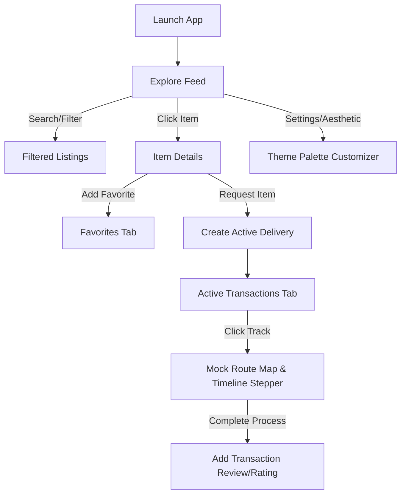

# Emanetly

[Türkçe README için tıklayın](README_TR.md)

A modern, community-driven campus marketplace and peer-to-peer item sharing mobile application built with Flutter. Emanetly enables university students and staff to lend and borrow low-value items (chargers, umbrellas, calculators, books, etc.) safely and efficiently within their campus ecosystem.

> [!NOTE]
> **MVP/Prototype Status**: This project is currently a Flutter UI/MVP prototype. Firebase integration, real QR scanning, real maps, and production backend features are simulated and planned for future versions.

---

## Overview

Emanetly is designed to digitize trust and sharing on university campuses. By creating a visual, modern marketplace format (similar to popular local shopping applications like Dolap), it allows users to view listings, mark favorites, leave trust rating reviews, customize theme aesthetics, and follow simulated routing maps for item handovers.

---

## Problem

On university campuses, students frequently need everyday items for short periods—such as a specific scientific calculator for an exam, an umbrella during a sudden downpour, or a charger between classes. Buying these items new is expensive and wasteful, while existing communication channels (e.g., social media groups or messaging apps) are unorganized, lack trust ratings, and offer no structured tracking for returns.

---

## Solution

Emanetly offers a specialized campus-sharing marketplace:
*   **Structured Listings**: Visual categories (Electronics, Books, Stationery, etc.) instead of chaotic chat lines.
*   **Trust Ratings**: A feedback-driven rating system that encourages reliable sharing.
*   **Real-time Delivery Timeline**: Clear status steps for requesting, meeting up, and completing handovers.
*   **Interactive Pathing**: Simulates paths between campus buildings so borrowers can easily locate lenders.

---

## Features

*   **Modern Flutter UI**: Polished, responsive layout built using Material 3 guidelines.
*   **Customizer System (Appearance)**: Live-switch between Light and Dark modes and 4 custom-tailored color palettes (Kampüs Klasik, Zümrüt Ormanı, Derin Okyanus, Lavanta Bahçesi).
*   **Flexible Feed Densities**: Select between **Compact Grid** (pure visuals, image-only), **Standard Grid** (Dolap-style visual + title), and **Large Cards** (full summary and description).
*   **Favorites & Search**: Instantly filter listings by query or category chips, and toggle items to a dedicated Favorites tab.
*   **Granular Reviews & Ratings**: Display owner profiles with calculated trust scores and a history of transaction comments.
*   **Simulated Route Tracking**: An interactive campus map using a custom painter showing active delivery coordinates, meeting points, and linear order progress.

---

## Screenshots

| Explore Feed (Large View) | Item Details Screen | Profile & Listings |
| :---: | :---: | :---: |
|  |  |  |

---

## Tech Stack

*   **Framework**: [Flutter](https://flutter.dev) (Dart)
*   **State Management**: `InheritedNotifier` provider architecture for light, reactive rebuilding.
*   **UI System**: Material 3 theme configurations, custom path drawing (`CustomPainter`), and fluid micro-animations.

---

## App Flow



---

## Project Structure

```text
lib/
├── main.dart                 # Application entry point
├── models/
│   ├── comment.dart          # Review and rating data model
│   └── item.dart             # EmanetItem model with delivery statuses
├── providers/
│   ├── app_state.dart        # Core provider managing app-wide local state
│   └── app_state_provider.dart
├── screens/
│   ├── main_layout.dart      # Bottom navigation shell coordinator
│   ├── home_screen.dart      # Discovery feed screen with view switchers
│   ├── item_detail_screen.dart # Hero headers, ratings, and comments list
│   ├── favorites_screen.dart # Favorite items grid
│   ├── settings_screen.dart  # Palette customizer and live preview
│   ├── active_transactions_screen.dart # Lists active lendings
│   ├── mock_route_screen.dart # Custom Paint campus maps and simulator
│   └── profile_screen.dart   # Profile details and owner's active listings
├── services/
│   ├── auth_service.dart     # Mock Authentication
│   ├── item_service.dart     # Seed data and state actions
│   └── qr_service.dart       # Mock QR handler
└── theme/
    └── app_theme.dart        # M3 light/dark seeds and palettes
```

---

## Installation

### Prerequisites
Make sure you have [Flutter SDK](https://docs.flutter.dev/get-started/install) installed on your system.

### Steps
1.  **Clone the Repository**:
    ```bash
    git clone https://github.com/ahmeteminoz/Emanetly.git
    cd Emanetly
    ```
2.  **Get Dependencies**:
    ```bash
    flutter pub get
    ```

---

## Running the App

Run the application locally on your emulator or connected device:
```bash
flutter run
```

To run built-in widget smoke tests:
```bash
flutter test
```

---

## Roadmap & Future Improvements

*   [ ] **Firebase Integration**: Authenticate users using campus mail addresses (`.edu.tr`) and persist listings in Firestore.
*   [ ] **Real QR Scanning**: Utilize device camera packages to scan handovers secure and complete.
*   [ ] **Google Maps Integration**: Replace simulated path painters with live coordinates and geopins.
*   [ ] **Push Notifications**: Notify users when an item request is accepted or return deadlines approach.

---

## License

This project is licensed under the MIT License - see the LICENSE file for details.
