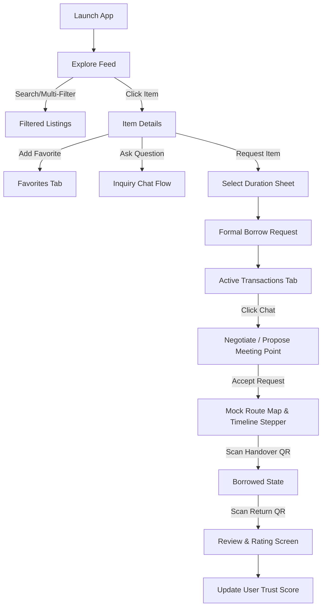

# Emanetly

[Türkçe README için tıklayın](README_TR.md)

A modern, community-driven campus marketplace and peer-to-peer item sharing mobile application built with Flutter. Emanetly enables university students and staff to lend and borrow everyday items (chargers, calculators, books, tools, etc.) safely and efficiently within their campus ecosystem.

---

## Overview

Emanetly is designed to digitize trust and sharing on university campuses. By creating a visual, modern marketplace format (similar to popular local shopping applications like Dolap), it allows users to view listings, filter by categories, mark favorites, chat about handovers, and track simulated meetup routes. It places a major emphasis on community trust with a dedicated **Trust Dashboard**.

---

## Problem

On university campuses, students frequently need everyday items for short periods—such as a specific scientific calculator for an exam, an umbrella during a sudden downpour, or a charger between classes. Buying these items new is expensive and wasteful, while existing communication channels (e.g., social media groups or messaging apps) are unorganized, lack trust ratings, and offer no structured tracking for returns.

---

## Solution

Emanetly offers a specialized campus-sharing marketplace:
*   **Structured Listings**: Visual categories (Electronics, Books, Stationery, etc.) instead of chaotic chat lines.
*   **Trust Ratings**: A feedback-driven rating system that encourages reliable sharing.
*   **Real-time Delivery Timeline**: Clear status steps for requesting, meeting up, and completing handovers.
*   **Interactive Pathing**: Simulates paths between campus buildings so borrowers can easily locate lenders.

---

## Current MVP Status

Emanetly is currently an in-memory MVP prototype for university students. Below is the checklist of the current technical state:
*   **Current version**: in-memory MVP prototype
*   **Database**: Mock in-memory data (resets on hot restart)
*   **State management**: Provider / ChangeNotifier
*   **Backend**: Planned (not integrated yet)
*   **Firebase Auth**: Integrated (login, register, reset, verification)
*   **Firestore**: Partially Integrated (Stage 1 & 2: Users, Listings/Items, and Favorites are persisted on Firestore)
*   **Firebase Storage**: Planned (not integrated yet)
*   **Maps**: Planned (custom painted simulation currently)
*   **QR Code Handover**: Simulated (in-memory validation)
*   **Real-time chat**: Planned (local mock simulation currently)
*   **Push notifications**: Planned (not integrated yet)

---

## Features

*   **Visual Item Discovery**: Polished, responsive layout built using Material 3 guidelines.
*   **Category Filtering**: Collapsible, scrollable category filter bar with support for **multi-selecting** categories.
*   **Flexible Feed Densities**: Select between **Compact Grid** (image-only), **Standard Grid** (Dolap-style visual + details), and **Large Cards** (full summary). 
*   **Expandable View Selector**: Premium micro-interaction that expands to show choices, collapses after 5 seconds of inactivity, or collapses instantly when the active icon is clicked.
*   **Favorites & Search**: Instantly filter listings by query or categories, and toggle items to a dedicated Favorites tab.
*   **Ask Question / Inquiry Chat Flow**: Ask questions about an item (`BorrowRequestStatus.onlyInquiry`) without initiating a formal borrow request. The owner can accept/reject once the request is formally upgraded.
*   **Borrow Request Flow**: Send official requests with a duration selector sheet (1 hour, 2 hours, 6 hours, 1 day, 3 days, 1 week) that updates status to `pendingDiscussion`.
*   **Meeting Point Proposals**: Suggest specific campus coordinates and times within the chat thread.
*   **Simulated Route Tracking**: An interactive campus map using a custom painter showing active delivery coordinates, meeting points, and linear order progress.
*   **QR Handover Simulation**: Authenticate handovers by simulating scans supporting both `emanetly://` and legacy `kampusemanet://` deep link URL structures.
*   **Trust Dashboard Profile**: View your own profile with calculated trust scores, verification statuses (email, phone, student status), transaction statistics, achievements, active listings, and reviews.
*   **Public User Profile**: View other users' profiles in a read-only format showing only public safety metrics, preferred meetup locations, listings, and commented reviews with quick tags ("Zamanında teslim", "Hızlı iletişim"). Includes simulated Report/Block buttons.
*   **Settings Screen**: Clean settings screen supporting Light, Dark, and System theme selectors linked to `AppState` alongside toggles for privacy and notifications.

---

## Current Limitations

*   **No Real Backend**: All transactions, users, and listings are volatile and stored in local RAM.
*   **Data Resets on Hot Restart**: Restarting the app clears all simulated chat rooms, requests, and listings to standard mock states.
*   **No Real Authentication**: Authentic sessions are managed via Firebase, but other collections (items, chats) remain simulated mock data.
*   **No Real Maps**: Path drawing uses custom painters on mock canvas assets.
*   **Simulated QR & Chat**: Camera scans and message streams are local time-delayed mock tasks.
*   **No Real Image Picker**: Adding items or profile pictures uses fallback asset placeholders.

---

## Tech Stack

*   **Framework**: [Flutter](https://flutter.dev) (Dart)
*   **State Management**: `AppState` ChangeNotifier provider architecture for light, reactive rebuilding.
*   **UI System**: Material 3 theme configurations, custom path drawing (`CustomPainter`), and fluid micro-animations.

---

## App Flow



---

## Project Structure

```text
lib/
├── main.dart                 # Application entry point (EmanetlyApp)
├── models/
│   ├── borrow_request.dart   # Request metadata and chat states
│   ├── chat_message.dart     # Text, system, and proposal messages
│   ├── comment.dart          # Simple comment data
│   ├── item.dart             # EmanetItem details and statuses
│   ├── meeting_point_proposal.dart # Propose coordinates inside chats
│   └── user_profile.dart     # Trust metrics, badges, and reviews
├── providers/
│   ├── app_state.dart        # Core provider managing app-wide local state
│   └── app_state_provider.dart
├── screens/
│   ├── main_layout.dart      # Bottom navigation shell coordinator
│   ├── home_screen.dart      # Discovery feed with view density selectors
│   ├── item_detail_screen.dart # Details page with interactive owner cards
│   ├── favorites_screen.dart # Favorite items grid
│   ├── settings_screen.dart  # Theme selector and privacy switches
│   ├── active_transactions_screen.dart # Separated Gelen Kutusu / Taleplerim tabs
│   ├── mock_route_screen.dart # Custom Paint campus maps and simulator
│   ├── profile_screen.dart   # Private Trust Dashboard and demo switcher
│   └── public_profile_screen.dart # Read-only public profiles, comments, and items
├── services/
│   ├── auth_service.dart     # Mock Authentication and seeded users
│   ├── item_service.dart     # Seed data and state actions
│   └── qr_service.dart       # Mock QR handler with emanetly:// scheme
└── theme/
    └── app_theme.dart        # M3 light/dark seeds and palettes
```

---

## Installation

### Prerequisites
Make sure you have [Flutter SDK](https://docs.flutter.dev/get-started/install) installed on your system.

### Steps
1.  **Clone the Repository**:
    ```bash
    git clone https://github.com/ahmeteminoz/Emanetly.git
    cd Emanetly
    ```
2.  **Get Dependencies**:
    ```bash
    flutter pub get
    ```

---

## Running the App

Run the application locally on your emulator or connected device:
```bash
flutter run
```

To run built-in widget smoke tests:
```bash
flutter test
```

To run static analysis check:
```bash
flutter analyze
```

---

## Current Status & Limitations

*   **Firebase Authentication**: Integrated (`firebase_core` & `firebase_auth`). Supports login, register, password reset, and email verification.
*   **University Email Check**: Restricted to `.edu.tr` domains. Note that this is currently MVP-level client-side validation.
*   **App Data**: All listings, chat messages, meetings, and reviews remain in-memory mock data (not persisted in Firestore/Storage yet).
*   **Firestore, Storage, Real-time Chat**: Planned (see Roadmap below).

---

## Roadmap

1.  **Public Profile Screen & Owner Navigation**: Clickable owner cards on item details routing to read-only user metrics and comments. *(Completed)*
2.  **README and GitHub Cleanup**: Consolidating repository information and renaming KampusEmanet references to Emanetly. *(Completed)*
3.  **Firebase Authentication**: Implement actual campus student email (`.edu.tr`) verification flows. *(Completed - Fallback to Mock Auth enabled if options are not configured)*
4.  **Firestore Data Model Integration**: Migrate in-memory AppState lists to live Firebase collections. *(Planned)*
5.  **Firebase Storage**: Store item images and profile pictures in Storage buckets. *(Planned)*
6.  **Real-time Chat with Firestore**: Replace simulated streams with real Firestore listener channels. *(Planned)*
7.  **Real Google Maps Integration**: Replace painter simulations with live geofenced meeting coordinates. *(Planned)*
8.  **Real QR Handover Flow**: Implement device camera scanning and hash checks on meetup. *(Planned)*
9.  **Notifications and Reminders**: Set up FCM (Firebase Cloud Messaging) for handover and return alerts. *(Planned)*
10. **Production Polish**: Performance optimization, clean visual feedback animations, and App Store / Google Play prep.

---

## License

This project is licensed under the MIT License - see the LICENSE file for details.
