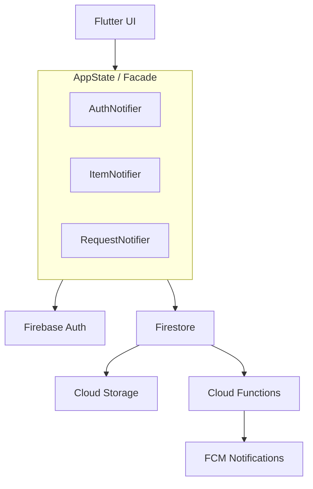

<div align="center">
  

  <h1>Emanetly</h1>
  <p><strong>Campus peer-to-peer borrowing platform</strong></p>

  <p>
    
    
    
    
  </p>

  <p>
    <em>Read this in <a href="README_TR.md">Türkçe</a>.</em>
  </p>
</div>

<hr />

## About Emanetly

Emanetly is a peer-to-peer borrowing platform designed specifically for university campuses. Students can list items they own, discover items available around their campus, send borrowing requests, communicate through real-time chat, and manage the lending and return process within the application.

<div align="center">
  <h3>DISCOVER → REQUEST → BORROW → RETURN</h3>
</div>

<hr />

## Screenshots

<div align="center">
  <table>
    <tr>
      <td align="center"><b>Home</b></td>
      <td align="center"><b>Detail</b></td>
      <td align="center"><b>Chat</b></td>
      <td align="center"><b>Notifications</b></td>
      <td align="center"><b>Profile</b></td>
    </tr>
    <tr>
      <td></td>
      <td></td>
      <td></td>
      <td></td>
      <td></td>
    </tr>
  </table>
</div>

<hr />

## Features

- **Campus-based item discovery:** Find items listed by students on your campus.
- **Borrow request lifecycle:** Seamlessly request, approve, and return items.
- **Real-time messaging:** Integrated participant-only chat for smooth coordination.
- **Push + in-app notifications:** Never miss an update on your requests.
- **User ratings & reviews:** Build trust with post-transaction peer reviews.
- **Favorites:** Save items you're interested in for later.
- **Blocking/reporting & moderation:** Secure environment with user protection tools.
- **Multi-image listings:** Showcase items effectively with multiple photos.

<hr />

## Architecture

Emanetly follows a scalable and maintainable architecture separating the UI, State, and Data layers.


```mermaid
graph TD
    UI[Flutter UI] --> State
    
    subgraph State [AppState / Facade]
        AN[AuthNotifier]
        IN[ItemNotifier]
        RN[RequestNotifier]
    end
    
    State --> FBAuth[Firebase Auth]
    State --> FS[Firestore]
    
    FS --> Storage[Cloud Storage]
    FS --> CF[Cloud Functions]
    
    CF --> FCM[FCM Notifications]
```

<hr />

## Backend & Security

Emanetly relies on a robust serverless backend ensuring data integrity and security.

- **Firebase Authentication:** Secure login and session management.
- **Firestore Security Rules:** Strict data access validation.
- **Participant-only chat access:** Only lenders and borrowers can view their chats.
- **Cloud Functions Gen 2:** Server-side logic for transactions and lifecycle events.
- **FCM token management:** Automated cleanup and targeted push notifications.
- **Idempotent notification processing:** Prevents duplicate notifications.
- **User blocking/reporting:** Server-enforced visibility restrictions.
- **Server-side review handling:** Reviews and trust scores are calculated securely on the backend to prevent tampering.

<hr />

## Tech Stack

| Mobile | Backend | Database | Storage | Notifications | Architecture |
| :---: | :---: | :---: | :---: | :---: | :---: |
| Flutter · Dart | Firebase · Node.js | Cloud Firestore | Cloud Storage | Cloud Messaging | Provider + Notifiers |

<hr />

## Project Structure

```text
lib/
├── screens/        # Application UI
├── services/       # Firebase and domain services
├── providers/
│   └── notifiers/  # Auth, Item and Request state managers
├── models/         # Domain models
└── widgets/        # Reusable UI components

functions/
└── src/            # Cloud Functions (TypeScript)

test/               # Flutter tests
```

<hr />

## Testing & Quality

- `flutter analyze`
- `flutter test`
- Firebase Emulator Suite
- Firestore/Storage Rules tests
- Real-device Android QA

<hr />

## Roadmap

- [x] Core borrowing flow
- [x] Real-time chat
- [x] Reviews
- [ ] Push notifications
- [ ] Closed beta
- [ ] Improved notification deep linking
- [ ] iOS validation
- [ ] Campus expansion
