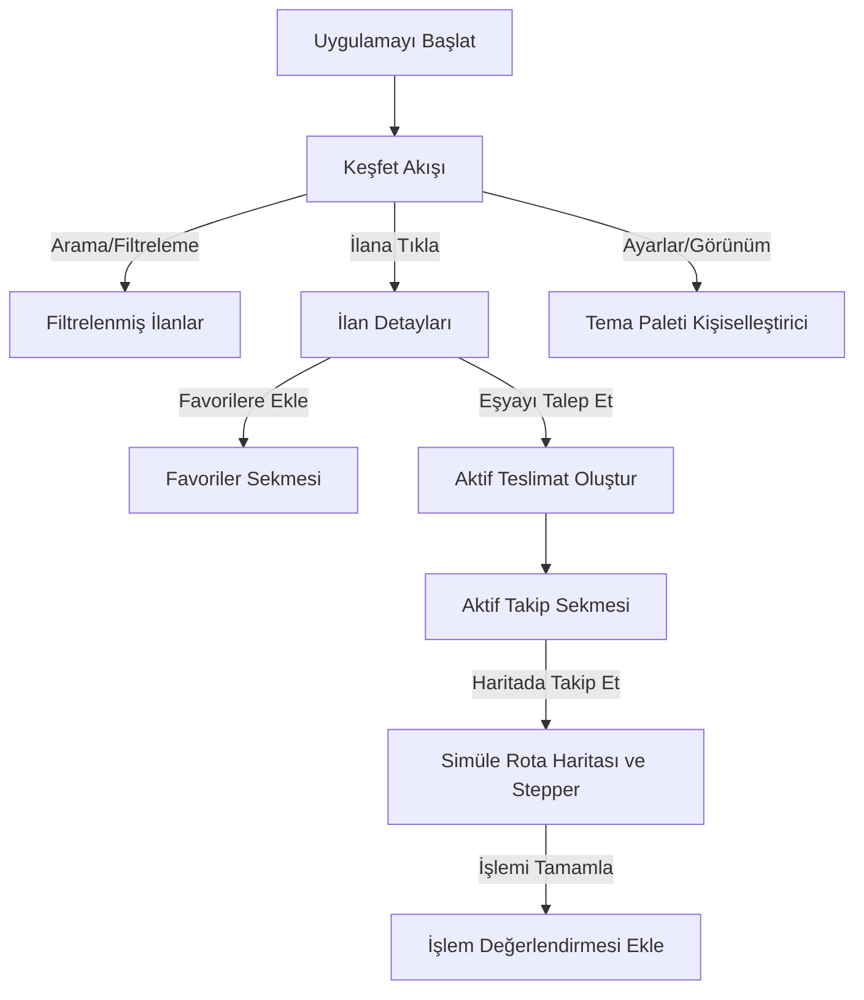

# Emanetly

[Click here for English README](README.md)

Emanetly, üniversite kampüslerinde öğrencilerin ve çalışanların günlük ihtiyaç duydukları düşük değerli eşyaları (şarj aletleri, şemsiyeler, hesap makineleri, kitaplar vb.) kampüs ekosistemi içinde güvenli ve verimli bir şekilde ödünç alıp verebilmelerini sağlayan, Flutter ile geliştirilmiş modern, topluluk odaklı bir mobil pazar yeri ve paylaşım uygulamasıdır.

> [!NOTE]
> **MVP/Prototip Durumu**: Bu proje şu anda bir Flutter UI/MVP prototipidir. Firebase entegrasyonu, gerçek QR tarama, gerçek haritalar ve canlı sunucu özellikleri gelecek sürümler için planlanmış olup, şu anki sürümde yerel durum (state) ile simüle edilmektedir.

---

## Genel Bakış

Emanetly, üniversite kampüslerinde güveni ve paylaşımı dijitalleştirmek için tasarlanmıştır. Popüler ikinci el alışveriş uygulamalarına (Dolap gibi) benzer, görsel ve modern bir pazar yeri formatı sunarak kullanıcıların ilanları incelemesine, favorilere eklemesine, güven puanı yorumları bırakmasına, tema estetiğini kişiselleştirmesine ve eşya teslimatları için simüle edilmiş rota haritalarını takip etmesine olanak tanır.

---

## Problem

Üniversite kampüslerinde öğrenciler sıklıkla kısa süreliğine günlük eşyalara ihtiyaç duyarlar; sınav için bilimsel bir hesap makinesi, ani bir yağmurda şemsiye veya ders aralarında bir şarj cihazı gibi. Bu eşyaları yeni satın almak pahalı ve israflı bir çözümdür. Diğer yandan, mevcut iletişim kanalları (sosyal medya grupları veya mesajlaşma uygulamaları) düzensizdir, güven puanı barındırmaz ve iadeler için yapılandırılmış bir takip sunmaz.

---

## Çözüm

Emanetly, kampüse özel organize bir paylaşım pazar yeri sunar:
*   **Yapılandırılmış İlanlar**: Karmaşık sohbet satırları yerine görsel kategoriler (Elektronik, Kitap, Kırtasiye vb.).
*   **Güven Puanları**: Güvenilir paylaşımı teşvik eden, geri bildirim odaklı bir puanlama sistemi.
*   **Gerçek Zamanlı Teslimat Akışı**: İstek gönderme, buluşma ve teslimatı tamamlama adımlarını gösteren net bir zaman çizelgesi (timeline).
*   **Etkileşimli Kampüs Haritası**: Ödünç alan kişinin ödünç veren kişiyi kolayca bulabilmesi için kampüs binaları arasındaki yolları simüle eder.

---

## Özellikler

*   **Modern Flutter Arayüzü**: Material 3 yönergelerine uygun, duyarlı ve şık düzenler.
*   **Tema Kişiselleştirme**: Açık ve Koyu mod ile 4 farklı özel renk paleti (Kampüs Klasik, Zümrüt Ormanı, Derin Okyanus, Lavanta Bahçesi) arasında canlı geçiş.
*   **Esnek Akış Görünümleri**: **Compact Grid** (sadece görsel odaklı), **Standard Grid** (Dolap tarzı görsel + başlık) ve **Large Cards** (açıklama ve detaylar dahil büyük kartlar) seçenekleri.
*   **Favoriler ve Arama**: Arama çubuğu veya kategori butonları ile anında filtreleme; ilanları favoriler sekmesine kaydedebilme.
*   **Değerlendirme ve Yorumlar**: Profil sayfalarında hesaplanan güven puanları ve geçmiş işlemlerin yorum geçmişi.
*   **Simüle Edilmiş Rota Takibi**: CustomPainter ile çizilmiş, teslimat konumlarını, buluşma noktalarını ve işlem adımlarını gösteren etkileşimli kampüs haritası.

---

## Ekran Görüntüleri

| Keşfet Akışı (Geniş Kartlar) | İlan Detay Ekranı | Profil ve İlanlarım |
| :---: | :---: | :---: |
|  |  |  |

---

## Kullanılan Teknolojiler

*   **Framework**: [Flutter](https://flutter.dev) (Dart)
*   **Durum Yönetimi (State Management)**: Hafif ve reaktif veri güncellemeleri için `InheritedNotifier` mimarisi.
*   **Arayüz Bileşenleri**: Material 3 tema yapılandırmaları, özel çizimler (`CustomPainter`) ve akıcı mikro-animasyonlar.

---

## Uygulama Akış Şeması



---

## Proje Yapısı

```text
lib/
├── main.dart                 # Uygulama giriş noktası
├── models/
│   ├── comment.dart          # Kullanıcı yorumları ve değerlendirme modeli
│   └── item.dart             # EmanetItem veri modeli ve teslimat durumları
├── providers/
│   ├── app_state.dart        # Uygulama geneli durum (state) yöneticisi
│   └── app_state_provider.dart
├── screens/
│   ├── main_layout.dart      # Alt navigasyon barı koordinatörü
│   ├── home_screen.dart      # Keşfet akışı ve görünüm geçişleri
│   ├── item_detail_screen.dart # Görsel alanı, puanlar ve yorumlar listesi
│   ├── favorites_screen.dart # Favorilere eklenen ilanların ızgarası
│   ├── settings_screen.dart  # Canlı önizlemeli görünüm ayarları
│   ├── active_transactions_screen.dart # Aktif işlemleri listeler
│   ├── mock_route_screen.dart # Özel çizim harita ve teslimat simülatörü
│   └── profile_screen.dart   # Profil detayları ve kullanıcının kendi ilanları
├── services/
│   ├── auth_service.dart     # Mock Kimlik Doğrulama Servisi
│   ├── item_service.dart     # Mock veriler ve teslimat durumu güncellemeleri
│   └── qr_service.dart       # Mock QR kod doğrulama servisi
└── theme/
    └── app_theme.dart        # M3 açık/koyu tema tohumları ve paletleri
```

---

## Kurulum

### Gereksinimler
Sisteminizde [Flutter SDK](https://docs.flutter.dev/get-started/install) kurulu olduğundan emin olun.

### Adımlar
1.  **Projeyi Klonlayın**:
    ```bash
    git clone https://github.com/ahmeteminoz/Emanetly.git
    cd Emanetly
    ```
2.  **Bağımlılıkları Yükleyin**:
    ```bash
    flutter pub get
    ```

---

## Uygulamayı Çalıştırma

Uygulamayı emülatörünüzde veya bağlı fiziksel cihazınızda başlatın:
```bash
flutter run
```

Yerleşik widget testlerini çalıştırmak için:
```bash
flutter test
```

---

## Yol Haritası ve Gelecek Geliştirmeler

*   [ ] **Firebase Entegrasyonu**: Kullanıcıları okul e-postaları (`.edu.tr`) ile doğrulamak ve ilanları Firestore üzerinde barındırmak.
*   [ ] **Gerçek QR Tarayıcı**: Teslimat doğrulamalarını kameradan QR okutarak güvenli hale getirmek.
*   [ ] **Google Haritalar**: Simüle çizim harita yerine gerçek harita SDK entegrasyonu ve pin yerleştirme.
*   [ ] **Anlık Bildirimler (Push Notifications)**: İsteklerin kabul edilmesi veya iade sürelerinin yaklaşması durumunda kullanıcıya bildirim göndermek.

---

## Lisans

Bu proje MIT Lisansı ile lisanslanmıştır - detaylar için LICENSE dosyasına göz atabilirsiniz.
