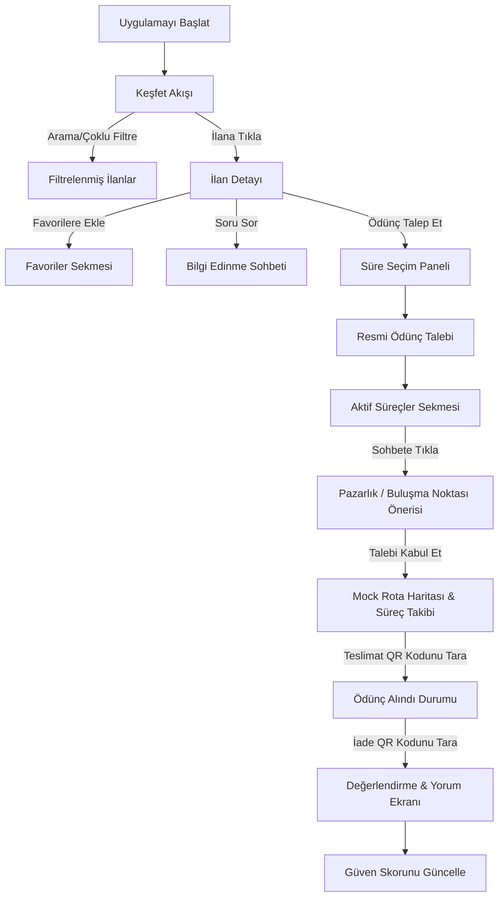

# Emanetly

[Click here for English README](README.md)

Üniversite kampüslerinde öğrencilerin ve çalışanların günlük ihtiyaç duydukları eşyaları (şarj aletleri, hesap makineleri, kitaplar, aletler vb.) kampüs ekosistemi içinde güvenli ve verimli bir şekilde ödünç alıp verebilmelerini sağlayan, Flutter ile geliştirilmiş modern, topluluk odaklı bir mobil pazar yeri ve paylaşım uygulamasıdır.

---

## Genel Bakış

Emanetly, üniversite kampüslerinde güveni ve paylaşımı dijitalleştirmek için tasarlanmıştır. Popüler ikinci el alışveriş uygulamalarına (Dolap gibi) benzer, görsel ve modern bir pazar yeri formatı sunarak kullanıcıların ilanları incelemesine, kategorilere göre filtrelemesine, favorilere eklemesine, teslimatlar için sohbet etmesine ve simüle edilmiş rota haritalarını takip etmesine olanak tanır. Uygulama, özel bir **Güven Paneli** ile topluluk güvenliğine büyük önem verir.

---

## Problem

Üniversite kampüslerinde öğrenciler sıklıkla kısa süreliğine günlük eşyalara ihtiyaç duyarlar; sınav için bilimsel bir hesap makinesi, ani bir yağmurda şemsiye veya ders aralarında bir şarj cihazı gibi. Bu eşyaları yeni satın almak pahalı ve israflı bir çözümdür. Diğer yandan, mevcut iletişim kanalları (sosyal medya grupları veya mesajlaşma uygulamaları) düzensizdir, güven puanı barındırmaz ve iadeler için yapılandırılmış bir takip sunmaz.

---

## Çözüm

Emanetly, kampüse özel yapılandırılmış bir paylaşım pazar yeri sunar:
*   **Yapılandırılmış İlanlar**: Karmaşık sohbet satırları yerine görsel kategoriler (Elektronik, Kitaplar, Kırtasiye vb.).
*   **Güven Puanları**: Güvenilir paylaşımı teşvik eden geri bildirime dayalı bir değerlendirme sistemi.
*   **Gerçek Zamanlı Teslimat Zaman Çizelgesi**: İstek gönderme, buluşma ve teslimat adımları için net süreç takibi.
*   **Etkileşimli Rota Çizimi**: Ödünç alanların ödünç verenleri kolayca bulabilmesi için kampüs binaları arasındaki yolları simüle eder.

---

## Mevcut MVP Durumu

Emanetly şu anda hibrit Firestore destekli bir MVP prototipidir. Mevcut teknik durum çeklistesi şu şekildedir:
*   **Mevcut Sürüm**: Firestore destekli MVP prototipi
*   **Veritabanı**: Firestore veritabanı kalıcılığı (Kullanıcı profilleri, İlanlar, Favoriler ve Ödünç Talepleri kalıcı hale getirildi)
*   **Durum Yönetimi (State)**: Provider / ChangeNotifier
*   **Firebase Auth**: Tamamen Entegre Edildi (giriş, kayıt, e-posta doğrulama)
*   **Firestore**: Tamamen Entegre Edildi (Kullanıcı profilleri, İlanlar/Eşyalar, Favoriler, Ödünç Talepleri, İncelemeler ve Güven Skoru)
*   **Firebase Storage**: Planlandı (şu anda hazır şablon görseller)
*   **Harita / Konum**: Planlandı (şu anda custom painter çizimiyle simüle edilmiştir)
*   **QR Kod Doğrulama**: Simüle edildi (bellek içi doğrulama)
*   **Gerçek Zamanlı Sohbet**: Planlandı (şu anda gecikmeli yerel simülasyon)
*   **Anlık Bildirimler (Push)**: Planlandı (henüz entegre edilmedi)

---

## Özellikler

*   **Görsel İlan Keşfi**: Material 3 yönergelerine uygun, şık ve duyarlı arayüz tasarımı.
*   **Kategori Filtreleme**: Sağa doğru kaydırılabilen ve **birden fazla kategori** seçilmesini destekleyen minimalist kategori çubukları.
*   **Esnek Akış Yoğunluğu**: **Yoğun Izgara** (sadece görsel), **Standart Izgara** (Dolap tarzı görsel + detaylar) ve **Geniş Kartlar** (tam özet) arasında geçiş.
*   **Yumuşak Görünüm Seçici Animasyonu**: Seçenekleri göstermek için genişleyen, 5 saniye işlem yapılmadığında veya aktif ikona tekrar basıldığında otomatik olarak daralan `AnimatedCrossFade` seçici paneli.
*   **Favoriler & Arama**: İlanları kelimeye veya kategorilere göre anında filtreleme, ilanları favoriler sekmesine ekleme/çıkarma.
*   **Soru Sor / Bilgi Edinme Sohbeti**: Bir ilan için resmi talep oluşturmadan soru sorma akışı (`BorrowRequestStatus.onlyInquiry`). İlan resmi talebe yükseltildiğinde onay/red butonları aktifleşir.
*   **Ödünç Talebi Akışı**: Süre seçici paneli (1 saat, 2 saat, 6 saat, 1 gün, 3 gün, 1 hafta) ile resmi talep gönderimi ve talebin Firestore veritabanına kaydedilmesi.
*   **İlan Yönetim Paneli**: İlan sahibinin eşyayı düzenlemesi, yayından kaldırması (arşivleme/yayınlama) veya veritabanından tamamen silmesi için kontrol paneli.
*   **Buluşma Noktası Önerileri**: Sohbet ekranında doğrudan kampüs koordinatları ve saat teklif etme.
*   **Simüle Edilmiş Rota Takibi**: Custom Painter ile çizilen, buluşma noktalarını ve işlem aşamalarını gösteren etkileşimli kampüs haritası.
*   **QR Doğrulama Simülasyonu**: `emanetly://` ve eski `kampusemanet://` şemalarını destekleyen QR tarama simülasyonu ile teslimat onaylama.
*   **Güven Paneli (Kişisel Profil)**: Güven skorunuzu, doğrulama durumlarınızı (e-posta, telefon, öğrenci kimliği), işlem istatistiklerinizi, rozetlerinizi ve gelen yorumları gösteren arayüz.
*   **Kamuya Açık Profil (Public Profile)**: Diğer kullanıcıların profillerini inceleyebileceğiniz, güvenlik aksiyonları (Bildir/Engelle) ve kullanıcının sadece aktif ilanları ile tag'li yorumlarını gösteren gizlilik odaklı salt okunur arayüz.
*   **Ayarlar Ekranı**: `AppState` ile entegre Açık/Koyu/Sistem teması seçici, bildirim ve konum gizliliği switchleri.

---

*   **Simüle Edilen Sohbet & Rota Verisi**: Sohbet mesajları ve aktif rota takibi yerel bellek içi (in-memory) saklanır ve uygulama yeniden başlatıldığında sıfırlanır. Kullanıcı profilleri, ilanlar, favoriler ve ödünç talepleri Firestore'da kalıcı olarak saklanmaktadır.
*   **Simüle Haritalar & QR Doğrulama**: Harita rota takibi ve QR kamera taramaları yerel simülasyonlar olarak çalışmaktadır.
*   **Fotoğraf Yükleme UI Şablonudur**: İlan ekleme formunda galeriden resim seçmek yerine hazır renk şablonları kullanılır.

---

## Teknoloji Altyapısı

*   **Çerçeve (Framework)**: [Flutter](https://flutter.dev) (Dart)
*   **Durum Yönetimi (State)**: Reaktif ve hafif yeniden derleme için `AppState` ChangeNotifier Provider mimarisi.
*   **Arayüz (UI)**: Material 3 tema yapılandırmaları, özel çizimler (`CustomPainter`) ve akıcı mikro-animasyonlar.

---

## Proje Akışı



---

## Proje Yapısı

```text
lib/
├── main.dart                 # Uygulama giriş noktası (EmanetlyApp)
├── models/
│   ├── borrow_request.dart   # Talep bilgileri ve sohbet durumları
│   ├── chat_message.dart     # Metin, sistem ve teklif mesajları
│   ├── comment.dart          # Basit yorum verisi
│   ├── item.dart             # EmanetItem detayları ve durumları
│   ├── meeting_point_proposal.dart # Sohbet içi buluşma teklifleri
│   └── user_profile.dart     # Güven metrikleri, rozetler ve yorumlar
├── providers/
│   ├── app_state.dart        # Uygulama genelindeki yerel durumu yöneten provider
│   └── app_state_provider.dart
├── screens/
│   ├── main_layout.dart      # Alt navigasyon paneli koordinatörü
│   ├── home_screen.dart      # Keşfet akışı ve görünüm modu butonları
│   ├── item_detail_screen.dart # Tıklanabilir sahip kartı içeren detay sayfası
│   ├── favorites_screen.dart # Favori ilanlar listesi
│   ├── settings_screen.dart  # Tema seçici ve gizlilik ayarları
│   ├── active_transactions_screen.dart # Gelen Kutusu / Taleplerim sekmeli görünümü
│   ├── mock_route_screen.dart # Custom Paint kampüs haritası simülatörü
│   ├── profile_screen.dart   # Kişisel Güven Paneli ve demo kullanıcı değiştirici
│   └── public_profile_screen.dart # Salt okunur kamu profili, ilanlar ve yorumlar
├── services/
│   ├── auth_service.dart     # Mock yetkilendirme ve ön tanımlı kullanıcılar
│   ├── item_service.dart     # Hazır ilan verileri ve durum aksiyonları
│   └── qr_service.dart       # emanetly:// şemalı mock QR servisi
└── theme/
    └── app_theme.dart        # M3 açık/koyu renk ve palet şemaları
```

---

## Kurulum ve Çalıştırma

### Gereksinimler
Sisteminizde [Flutter SDK](https://docs.flutter.dev/get-started/install) yüklü olduğundan emin olun.

### Adımlar
1.  **Depoyu Klonlayın**:
    ```bash
    git clone https://github.com/ahmeteminoz/Emanetly.git
    cd Emanetly
    ```
2.  **Bağımlılıkları Yükleyin**:
    ```bash
    flutter pub get
    ```
3.  **Projeyi Çalıştırın**:
    ```bash
    flutter run
    ```

Ssmoke testleri çalıştırmak için:
```bash
flutter test
```

Statik kod analizi yapmak için:
```bash
flutter analyze
```

---

## Mevcut Durum & Sınırlar (Limitations)

*   **Firebase Yetkilendirme (Auth)**: Entegre edildi (`firebase_core` & `firebase_auth`). Kayıt ol, giriş yap, şifre sıfırlama ve e-posta doğrulama süreçlerini destekler.
*   **Üniversite E-posta Kısıtlaması**: Sadece `.edu.tr` uzantılı e-postalara izin verilir. Bu kontrol şu an için MVP seviyesinde istemci tarafında (client-side) yapılmaktadır.
*   **Uygulama Verisi**: Eşya ilanları, kullanıcı profilleri, favoriler, ödünç talepleri, incelemeler ve işlem istatistikleri Firestore veritabanında kalıcı olarak saklanır. Sohbet mesajları yerel/simüle kalmaya devam etmektedir.
*   **Storage, Canlı Sohbet, Haritalar**: Planlanmaktadır (Aşağıdaki Yol Haritasına bakınız).

---

## Yol Haritası (Roadmap)

1.  **Kamuya Açık Profil Ekranı & Navigasyon**: İlan sahibinin kartından salt okunur profil görünümüne ve yorumlarına yönlendirme. *(Tamamlandı)*
2.  **README ve GitHub Temizliği**: Proje ismi referanslarının Emanetly olarak güncellenmesi. *(Tamamlandı)*
3.  **Firebase Yetkilendirme (Auth)**: Kampüs e-postası (`.edu.tr`) doğrulamalı üyelik sistemi. *(Tamamlandı - Yapılandırma dosyaları yoksa otomatik Mock Auth moduna döner)*
4.  **Firestore Entegrasyonu**: Bellek içi listenin canlı Firestore koleksiyonlarına (Users, Items, BorrowRequests) taşınması. *(Tamamlandı)*
5.  **Firebase Storage Entegrasyonu**: İlan ve profil resimlerinin saklanması. *(Planlandı)*
6.  **Firestore ile Canlı Sohbet**: Mesaj akışlarının gerçek zamanlı veritabanı kanallarına taşınması. *(Planlandı)*
7.  **Google Haritalar Entegrasyonu**: Simüle haritaların gerçek harita API'si ile değiştirilmesi. *(Planlandı)*
8.  **Gerçek QR Teslimat Akışı**: Mobil kamera ile QR okuma ve teslimat/iade hash doğrulaması. *(Planlandı)*
9.  **Anlık Bildirimler (FCM)**: Teslimat gecikmeleri ve yeni talepler için push bildirimleri. *(Planlandı)*
10. **Üretim Cilası & Yayına Hazırlık**: Performans iyileştirmeleri ve App Store / Play Store yayını.

---

## Lisans

Bu proje MIT Lisansı ile lisanslanmıştır - detaylar için LICENSE dosyasına bakabilirsiniz.
