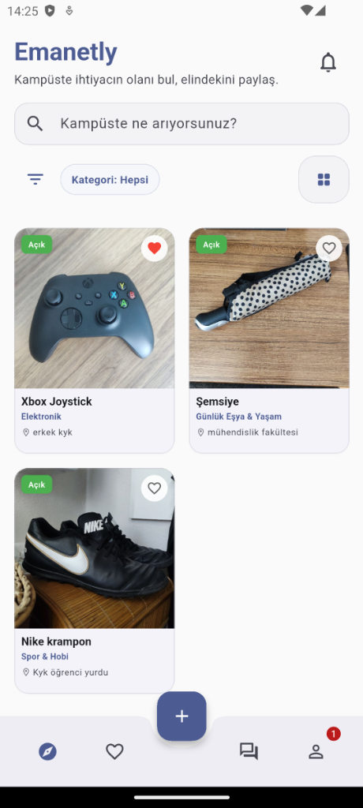
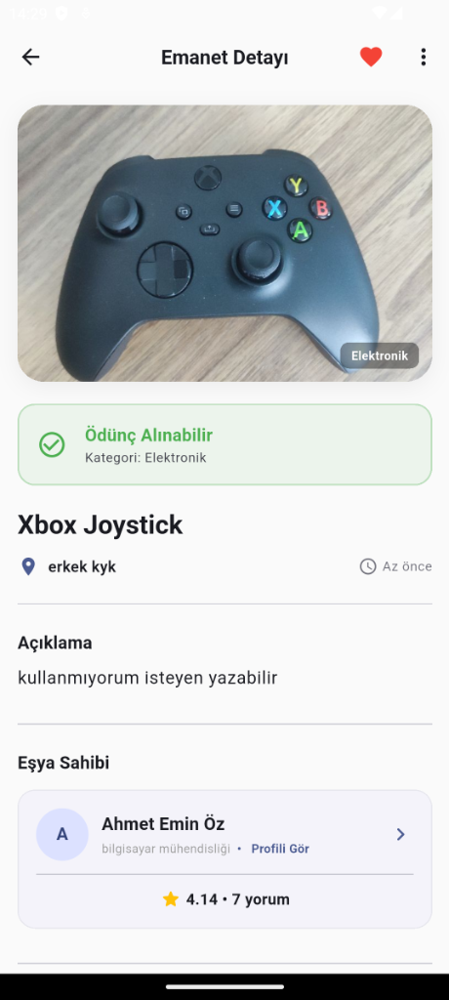
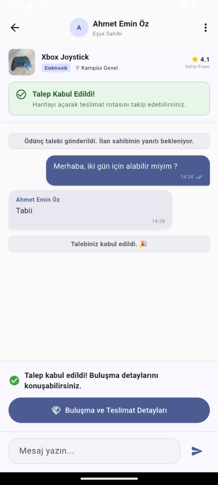
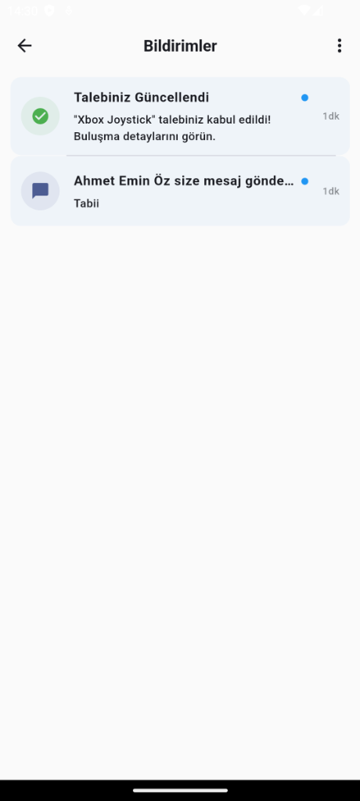
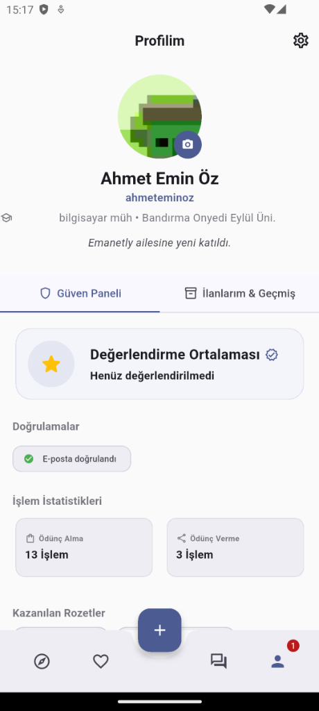
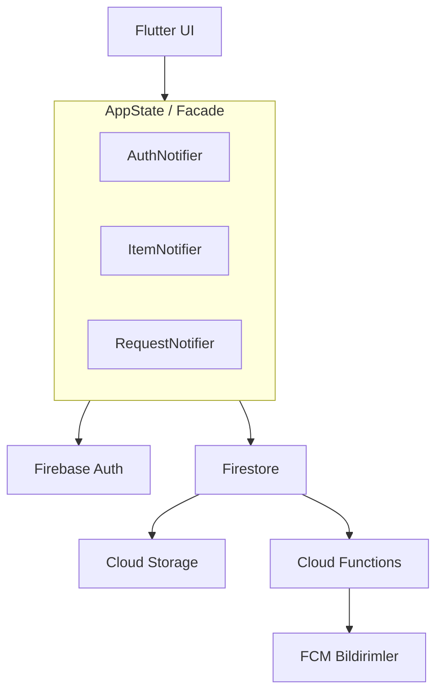

<div align="center">
  

  <h1>Emanetly</h1>
  <p><strong>Kampüs içi eşya ödünç alma ve paylaşım platformu</strong></p>

  <p>
    
    
    
    
  </p>

  <p>
    <em>Read this in <a href="README.md">English</a>.</em>
  </p>
</div>

<hr />

## Emanetly Nedir?

Emanetly, üniversite kampüsleri için özel olarak tasarlanmış, öğrenciler arası bir ödünç alma platformudur. Öğrenciler sahip oldukları eşyaları listeleyebilir, kampüslerinde bulunan eşyaları keşfedebilir, ödünç alma talepleri gönderebilir, gerçek zamanlı sohbet üzerinden iletişim kurabilir ve uygulamanın içinden tüm ödünç alma ve iade sürecini yönetebilirler.

<div align="center">
  <h3>KEŞFET → TALEP ET → ÖDÜNÇ AL → İADE ET</h3>
</div>

<hr />

## Ekran Görüntüleri

<div align="center">
  <table>
    <tr>
      <td align="center"><b>Ana Sayfa</b></td>
      <td align="center"><b>Detay</b></td>
      <td align="center"><b>Sohbet</b></td>
      <td align="center"><b>Bildirimler</b></td>
      <td align="center"><b>Profil</b></td>
    </tr>
    <tr>
      <td></td>
      <td></td>
      <td></td>
      <td></td>
      <td></td>
    </tr>
  </table>
</div>

<hr />

## Özellikler

- **Kampüs bazlı eşya keşfi:** Sadece kendi kampüsünüzdeki öğrencilerin yüklediği eşyaları görün.
- **Talep döngüsü:** Eşya talebinde bulunun, onaylayın ve teslim alın.
- **Gerçek zamanlı sohbet:** Teslimat detaylarını konuşmak için işleme özel sohbet odaları.
- **Anlık ve uygulama içi bildirimler:** Taleplerinizdeki değişiklikleri anında öğrenin.
- **Kullanıcı değerlendirme sistemi:** İşlem sonrasında karşı tarafı puanlayıp güven oluşturun.
- **Favoriler:** İlgilendiğiniz ilanları daha sonra bakmak üzere kaydedin.
- **Engelleme/Raporlama & Moderasyon:** Kullanıcı koruma araçlarıyla güvenli bir ortam.
- **Çoklu fotoğraf desteği:** İlanlarınıza birden fazla fotoğraf ekleyerek eşyayı daha iyi tanıtın.

<hr />

## Mimari

Emanetly; Kullanıcı Arayüzü (UI), Durum (State) ve Veri (Data) katmanlarını birbirinden ayıran, ölçeklenebilir ve bakımı kolay bir mimari kullanır.


```mermaid
graph TD
    UI[Flutter UI] --> State
    
    subgraph State [AppState / Facade]
        AN[AuthNotifier]
        IN[ItemNotifier]
        RN[RequestNotifier]
    end
    
    State --> FBAuth[Firebase Auth]
    State --> FS[Firestore]
    
    FS --> Storage[Cloud Storage]
    FS --> CF[Cloud Functions]
    
    CF --> FCM[FCM Bildirimler]
```

<hr />

## Arka Uç (Backend) & Güvenlik

Emanetly, veri bütünlüğünü ve güvenliğini sağlamak için sunucusuz (serverless) güçlü bir arka uç mimarisine güvenir.

- **Firebase Authentication:** Güvenli giriş ve oturum yönetimi.
- **Firestore Security Rules:** Sıkı veri erişim kuralları (sadece yetkisi olanlar okuyup/yazabilir).
- **Katılımcıya özel sohbet:** İki kişi arasındaki sohbete sadece eşya sahibi ve talep eden kişi erişebilir.
- **Cloud Functions Gen 2:** İşlem döngüleri ve yaşam döngüsü olayları için sunucu taraflı iş kuralları.
- **FCM token yönetimi:** Otomatik temizleme ve hedeflenmiş push bildirim gönderimi.
- **Idempotent bildirim işleme:** Aynı bildirimin tekrar tekrar atılmasını engeller.
- **Kullanıcı engelleme/raporlama:** Sunucu tarafından denetlenen gizlilik ve kısıtlama kuralları.
- **Sunucu taraflı değerlendirme:** İstatistiklerin manipüle edilmesini önlemek için "Puan/Yorum" hesaplamaları tamamen backend tarafında yapılır.

<hr />

## Teknoloji Yığını

| Mobil | Backend | Veritabanı | Depolama | Bildirimler | Mimari |
| :---: | :---: | :---: | :---: | :---: | :---: |
| Flutter · Dart | Firebase · Node.js | Cloud Firestore | Cloud Storage | Cloud Messaging | Provider + Notifiers |

<hr />

## Proje Yapısı

```text
lib/
├── screens/        # Uygulama Arayüzü (UI)
├── services/       # Firebase ve servis katmanı
├── providers/
│   └── notifiers/  # Auth, Item ve Request durum yöneticileri
├── models/         # Modeller
└── widgets/        # Tekrar kullanılabilir UI bileşenleri

functions/
└── src/            # Cloud Functions (TypeScript)

test/               # Flutter testleri
```

<hr />

## Test ve Kalite

- `flutter analyze`
- `flutter test`
- Firebase Emulator Suite
- Firestore/Storage Güvenlik Kuralı Testleri
- Gerçek Android cihazda testler

<hr />

## Yol Haritası (Roadmap)

- [x] Temel ödünç alma/verme akışı
- [x] Gerçek zamanlı sohbet
- [x] Değerlendirme sistemi
- [ ] Push bildirimleri
- [ ] Kapalı beta
- [ ] Geliştirilmiş bildirim yönlendirmeleri (Deep linking)
- [ ] iOS uyumluluk ve testleri
- [ ] Kampüs sayısını genişletme
