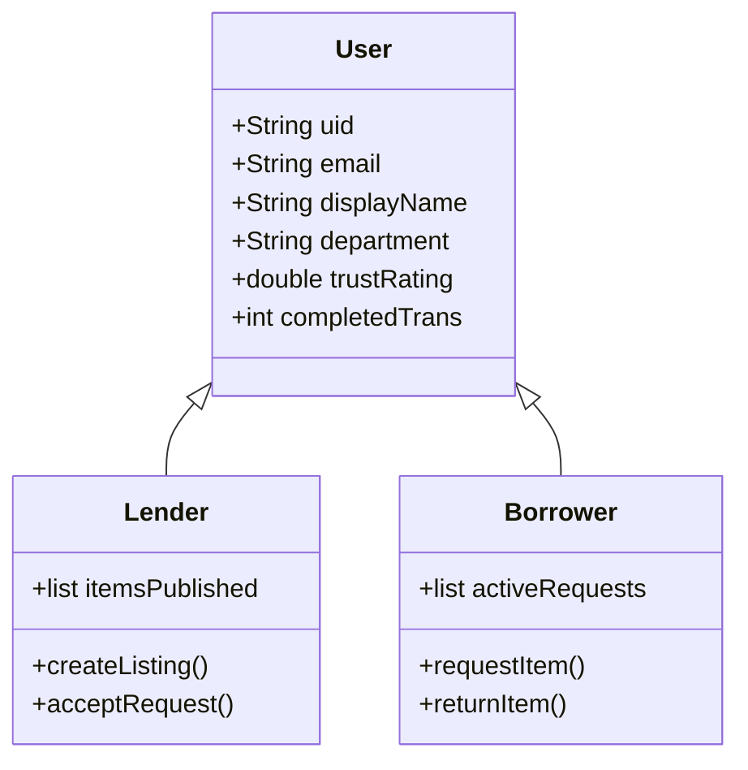

# Emanetly Project Plan

This document outlines the architectural plan, planned services, scope, and technical roadmap to scale the **Emanetly** prototype into a production-grade campus peer-to-peer sharing application.

---

## MVP Scope

The Minimum Viable Product (MVP) targets a single university campus ecosystem, requiring users to authenticate using verified campus email addresses (`.edu.tr`). 

### Core User Stories:
1.  **Lenders**: Can publish items, specify pick-up locations, set borrowing durations, accept/reject requests, and track returns.
2.  **Borrowers**: Can discover items, filter by categories, request items, view pick-up directions, and perform QR-based verification during handovers.
3.  **Community**: Can review transaction logs and assign trust ratings based on reliability and item care.

---

## User Roles



---

## Core Data Models

### 1. User Profile (`users` Collection)
```json
{
  "uid": "user_12345",
  "email": "student@ogrenci.edu.tr",
  "displayName": "Ahmet Öz",
  "department": "Computer Engineering",
  "photoUrl": "https://example.com/avatar.png",
  "trustRating": 4.8,
  "transactionCount": 32,
  "createdAt": "2026-07-04T12:00:00Z"
}
```

### 2. Marketplace Item (`items` Collection)
```json
{
  "id": "item_98765",
  "title": "Casio fx-991EX Scientific Calculator",
  "description": "Perfect for mathematics and engineering exams.",
  "category": "Electronics",
  "location": "Engineering Faculty Building B",
  "lenderId": "user_12345",
  "lenderName": "Ahmet Öz",
  "status": "available", // available, requested, onLoan, archived
  "createdAt": "2026-07-04T14:44:00Z"
}
```

### 3. Sharing Transaction (`transactions` Collection)
```json
{
  "id": "tx_abcde",
  "itemId": "item_98765",
  "lenderId": "user_12345",
  "borrowerId": "user_67890",
  "status": "meetingPointSet", // requested, meetingPointSet, routingStarted, delivered, completed
  "pickupLocation": {
    "latitude": 41.0082,
    "longitude": 28.9784,
    "name": "Central Library"
  },
  "qrCodeHash": "secure_handover_hash_123",
  "borrowedAt": null,
  "returnedAt": null
}
```

---

## Planned Firebase Architecture

We plan to use a serverless backend powered by **Firebase** for rapid, scalable deployment:
*   **Firebase Authentication**: Restricts registration exclusively to domains ending in `.edu.tr` via custom trigger validations.
*   **Cloud Firestore**: Document-based real-time database syncing items, user ratings, and active transaction statuses.
*   **Firebase Cloud Storage**: Secure hosting for user profile photos and product listing images.
*   **Cloud Functions**: Automates rating calculations upon transaction completion and triggers background push notifications for upcoming return deadlines.

---

## Planned Handover Lifecycle (QR Flow)

To ensure secure transactions and prevent disputes, item handovers are validated via secure local QR tokens:

```text
[Lender] (Generates Handover QR) ──> [Shows Screen to Borrower]
                                            │
[Borrower] (Scans with Device Camera) <─────┘
        │
        ▼ (App validates qrCodeHash via Firebase Cloud Function)
[Handover Verified] ──> Status updates to "onLoan" / "delivered"
```

---

## Planned Map & Route Flow

1.  **Google Maps SDK Integration**: Replaces the custom painted layout with an embedded map view.
2.  **Geocoding & Pins**: Coordinates of campus locations (faculties, library, social spaces) are marked using custom map pins.
3.  **Real-Time Geolocation**: During an active checkout, borrower and lender locations are fetched via the GPS API to calculate distance and dynamic arrival estimates.

---

## Roadmap

### Phase 1: Interactive UI/MVP (Completed)
*   [x] Core layouts, feed switches, and settings palette configurations.
*   [x] Mock canvas maps, reviews listings, and transaction trackers.
*   [x] Verification smoke tests.

### Phase 2: Backend Integration (Future Work)
*   [ ] Set up Firebase project and configure auth domain restrictions.
*   [ ] Implement Firestore sync controllers for feed listings.
*   [ ] Integrate Camera & `mobile_scanner` packages for QR handovers.

### Phase 3: Launch & Polish (Future Work)
*   [ ] Add push notifications via Firebase Cloud Messaging (FCM).
*   [ ] Deploy real Google Maps tracking.
*   [ ] Conduct beta testing inside a single campus.
